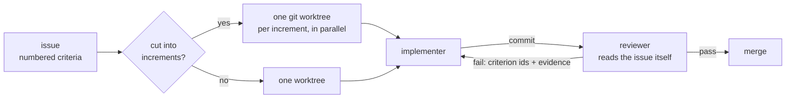

<div align="center">

# ai-blacksmith

**Two Claude Code plugins that treat tokens and architecture as things you measure, not things you
hope about.**

[](LICENSE)
[](https://code.claude.com/docs/en/claude-code)
[](#requirements)
[](#zero-dependencies)

[Install](#install) · [Forge](#forge--issues-in-shape-executed-autonomously) ·
[Cast](#cast--the-module-graph-and-what-is-wrong-with-it) · [Why](#why-this-exists) ·
[Development](#development)

</div>

---

An agent that codes for you fails in two predictable ways: it burns a context window re-reading
what it already knew, and it leaves behind a dependency graph nobody is looking at. This
repository is a marketplace of two plugins, one for each failure.

| Plugin | What it does | Docs |
| --- | --- | --- |
| **[forge](plugins/forge)** | Interviews an issue into acceptance criteria, then executes it autonomously on the smallest token budget that works. | [`plugins/forge/README.md`](plugins/forge/README.md) |
| **[cast](plugins/cast)** | Writes the module graph of a project and says what is wrong with it - cycles, layer violations, unresolved imports. | [`plugins/cast/README.md`](plugins/cast/README.md) |

They are independent. Install either one alone.

## Why this exists

### The token budget is a measurement, not a slogan

Every subagent re-pays a system prompt, the `CLAUDE.md` hierarchy and the project rules before it
does a single useful thing. forge treats that as the unit of cost and instruments it:
`/forge:context` breaks a run's start down by source, `/forge:stats` reads tool calls and tokens
per run out of `.forge/metrics.jsonl`. Four mechanisms then hold the budget down, each enforced by
a hook rather than by asking the model nicely:

- **Wrapper commands** (`forge-test`, `forge-lint`, `forge-typecheck`, `forge-build`) exit `0` with
  one line or `1` with every failure and its detail. No agent ever pages through green test output.
- **A guard hook** rewrites a raw runner - `npm test`, `pytest`, `cargo test` - into its wrapper,
  and refuses it with a named reason when the mapping is not exact
  ([`scripts/guard-bash.js`](plugins/forge/scripts/guard-bash.js)).
- **A compaction hook** withholds oversized Bash stdout to a log and tells the agent the size, the
  path and the cheaper ways to read it. stderr is never touched - stripping error detail makes an
  agent proceed on a false assumption, which costs more than it saves
  ([`scripts/compact-output.js`](plugins/forge/scripts/compact-output.js)).
- **Area notes** (`.claude/rules/areas/<area>.md`) load only when a file they match is read, so
  directory knowledge costs nothing until an agent works there.

### A reviewer that cannot mark its own homework

`/forge:work` runs a loop of implement and review until the verdict converges. The separation is
structural, not aspirational:



- The reviewer reads the issue from the backend itself. Nothing the implementer wrote about its own
  work reaches it - an account of the change would be what it graded
  ([`workflows/work.js:16-18`](plugins/forge/workflows/work.js)).
- A `PreToolUse` hook blocks the reviewer from writing anywhere inside the checkout it is judging.
  A page can say "you touch no code" and be obeyed every time but the one that matters; probes go
  to a worktree outside ([`scripts/guard-checkout.js`](plugins/forge/scripts/guard-checkout.js)).
- A failure the change did not cause is proven at the base commit in a throwaway worktree and
  reported as pre-existing, never as a finding.
- The loop stalls on a repeated failure set and stops at eight rounds, rather than oscillating
  forever.

### Architecture read from the graph, not from memory

cast answers "what depends on what" by scanning, not by recalling. What follows from that:

- **A refactoring is judged before a file is edited.** `cast plan simulate` applies an ordered list
  of `move` / `merge` / `invert` / `split` operations to a *copy* of the graph and reports the
  cycles, the per-layer fan-in, fan-out and instability, and the rule violations before and after.
  It writes no source file and no graph file.
- **A rule is priced before it is enforced.** `severity: "warn"` lists every site a rule would
  break on and leaves the exit code alone. Read the count, then fix the sites, hold them in a
  baseline, or drop the rule.
- **The baseline is a ratchet.** `cast baseline --update` refuses, with exit 1, to write a baseline
  holding more violations than the one it replaces. A rule cannot quietly stop meaning anything.
- **Nothing lands in your checkout.** The graph is derived state, so `scan` writes it to a scratch
  directory under the system temp, keyed by the root. There is nothing to gitignore.
- **No language knowledge in the engine.** Which files are modules, which text is an import and how
  a specifier resolves come from an adapter file. A project drops its own into
  `.cast/adapters/`, and a second language arrives without touching the engine.
- **Nothing is silently dropped.** An import that resolves to nothing is kept as an edge and named.
  An import whose target is not a literal string is counted as `opaque` and named. A graph missing
  edges has to say so.

### One self-contained page, no view-time fetch

`cast render --html` writes a page that draws the graph itself, in SVG, from a description embedded
in the file. It carries a containment tree over the whole project - layer, then each folder level,
then the file - and any node with children opens at any depth. Breaking edges are drawn in the
colour of their severity and labelled with the rule; inherited ones are grey and dashed. Every
colour is a theme token, and `--fragment` drops the document skeleton so the page can be published
as a Claude Code artifact.

### Zero dependencies

No `package.json`, no lockfile, no install step. cast is one 2.2k-line Node script over `fs`,
`os`, `path` and `crypto`. The forge hooks and workflow are the same. Clone it and it runs.

### Self-hosted

The plugins are developed with themselves: `.claude/skills`, `.claude/agents` and
`.claude/workflows` are symlinks into `plugins/`, so an edit is live in the session that made it. The
checks are one dependency-free `test.sh` - **87 suites, no Claude Code session required** - and
they cover the skill and agent prose as well as the code, because on a plugin the prose *is* the
behaviour.

## Install

```bash
/plugin marketplace add artkoenig/ai-blacksmith
/plugin install forge@artkoenig-marketplace
/plugin install cast@artkoenig-marketplace
```

Install at user scope - a project-scope plugin loads only after the workspace trust dialog.

## forge — issues in shape, executed autonomously

```
/forge:bootstrap          set the project up: check commands, issue backend, rules
/forge:issue              interview, then write one issue with numbered criteria
/forge:work <id>          implement and review until the verdict converges
/forge:insights <dir>     record what an agent learned about one directory
/forge:context            what each agent loads at startup, by source
/forge:stats              tool calls and tokens per agent run
```

Run `/forge:bootstrap` in the target repository first - it detects the check commands and the issue
backend, writes the adapter, and says what breaks if a requirement is missing.

Full command reference and the token levers: [`plugins/forge/README.md`](plugins/forge/README.md).

## cast — the module graph, and what is wrong with it

```bash
cast scan                          # write the graph, print where it went
cast report                        # cycles, unresolved imports, layer sizes
cast check                         # evaluate .cast/rules.json against the graph
cast edges --from ui --to logic    # the module edges behind one layer edge
cast plan simulate <name>          # what a refactoring would change, before you edit
cast render --html graph.html      # one self-contained page
```

In a session, `/cast:map` shows the graph and `/cast:plan` drafts a refactoring. Where the answer
needs more than one look, two agents do it instead - `cast:graph-analyst` and
`cast:refactor-planner` - each returning a few sentences and a path, so the report, the edge
listings and the rounds of simulation never land in the context that asked.

Layers, rules, baselines, plans, rendering and the adapter contract:
[`plugins/cast/README.md`](plugins/cast/README.md).

## Requirements

- **Claude Code v2.1.154 or later**, with workflows available on your plan. On Pro, enable
  **Dynamic workflows** in `/config` - without them there is no `/forge:work`. `/forge:context`
  needs v2.1.234 or later for its `SubagentStart` hook.
- **Node** on `PATH`. Nothing else.

`/forge:bootstrap` checks all of this and names what is missing.

## Repository layout

```
plugins/forge/        skills, agents, workflow, hooks, wrapper commands
plugins/cast/         engine, adapters, skills, agents, hooks
.claude/              symlinks into plugins/ - the plugins developed with themselves
.claude-plugin/       the marketplace manifest
test.sh               every check that runs without a Claude Code session
```

## Development

```bash
./test.sh             # 87 suites; one line each, "FAIL <suite>: <what>" on a break
```

`plugins/` is the source. `.claude/skills`, `.claude/agents` and `.claude/workflows` symlink into
it - never edit through the symlink path.

No plugin pins a version on purpose: each is released from the tip of `main`, so the commit is the
version.

## License

[MIT](LICENSE) © Artjom König
