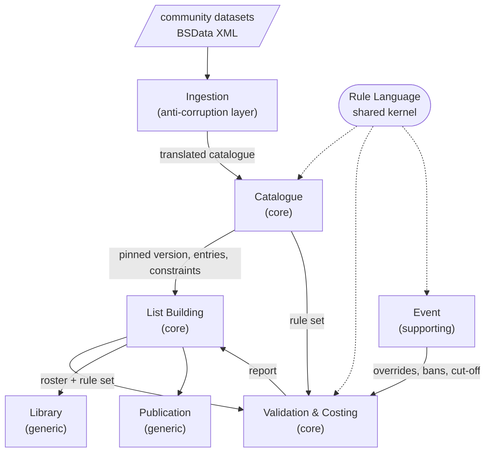

# Army builder — domain-driven architecture

A proposal for the architecture of a multi-system, data-driven, local-first army builder for
tabletop wargames. No code exists yet; this document decides the shape before any is written.

Every domain fact below is sourced from `docs/army-builder/domain-analysis.md`, which was researched
against publisher rules documents, tournament packs and the community datasets themselves. Where
this document states a domain fact it names the section it came from.

---

## 1. What was decided

| Decision | Choice | Consequence for the architecture |
|---|---|---|
| Scope | Several game systems, data-driven | The rules cannot live in the code as `if` statements. A constraint language becomes the core domain. |
| Catalogue data | Import community datasets (BSData) | An anti-corruption layer at the import boundary. The foreign schema must not become our model. |
| Delivery | Local-first | The domain carries no persistence or network dependency. Storage and sync are outbound ports. |
| Stage | Architecture only, no code yet | This document, and the issues that follow from it. |

Two of these carry risk that is worth naming before anything is built. Both are in §7.

---

## 2. The domain in short

A player builds a list for an occasion, under a budget, from a faction's catalogue, inside an
organising structure, and takes it to a table. Fourteen steps, each with its own failure mode; the
largest class of failure is a list that is legal unit by unit and illegal as a whole
(`domain-analysis.md:42`).

Three findings from the analysis drive every decision in this document.

**Constraints have four scopes, not two** (`domain-analysis.md:396`):

- **local** — one unit alone: legal model counts, wargear per model, options scaled to unit size.
- **structural** — one block within the list: a 40k detachment, an Age of Sigmar regiment, a Kings
  of War battalion. Kings of War carries both at once: `[n]` limits per battalion, `[U]` uniqueness
  per list.
- **global** — the whole list: points, duplicate caps, one warlord, concentration caps, unlock
  chains.
- **external** — beyond the list: team composition at the WTC, and Infinity's rule that both of a
  player's two lists come from one army.

**Cost is not a property of an entry** (`domain-analysis.md:424`). Age of Sigmar's auxiliary
surcharge is cumulative over the list; Malifaux prices out-of-keyword hiring at +1 rather than
forbidding it. These are not legality rules at all — they change the cost function. A model that
stores a price on a catalogue entry and sums it cannot express them.

**Legality is relative to a data version** (`domain-analysis.md:520`). A list legal on Monday is
illegal on Tuesday after a points change. The version is part of the list's state, not metadata
about it — which is why tournament packs write rules cut-off dates into the pack.

---

## 3. Strategic design — the bounded contexts



### Catalogue — core

Owns what a game system offers: entries, profiles, options, keywords, costs, structural
definitions, and the constraints attached to each. Its language is the publisher's.

A **catalogue version is immutable**. A points update does not mutate a catalogue; it produces a new
version. This falls straight out of the domain: legality is stated against a version, and a list
played under one version cannot be re-judged under another (`domain-analysis.md:520`).

### List Building — core

Owns the roster the player is assembling: the selections, their structure, the model counts, the
chosen options. Its language is the player's.

### Validation & Costing — core

Evaluates a rule set against a roster and returns a report: errors, warnings, and cost adjustments.
Costing lives here rather than in Catalogue because the domain's cost functions read the whole list.

Splitting this from List Building is the central decision of this document and it is argued in §4.

### Event — supporting

Owns a tournament's own layer: battle size, bans and allowances, rules cut-off date, submission
deadline and format, team composition. A pack can *disable published rules*
(`domain-analysis.md:451`), so the rule set that applies is `published ⊕ event overrides`, not a
fixed program. That composition is the reason Event is a context and not a flag on a roster.

Defer building this. Design for it now, so that "the rule set" is already a composed value on day
one and the event layer is one more term in the composition.

### Ingestion — supporting, and an anti-corruption layer

Owns the translation of a foreign dataset into our catalogue. Nothing downstream of it knows that
BSData exists, that it is XML, or how it expresses a modifier.

BSData is a GitHub organisation of XML data files, maintained by volunteers, endorsed by no
publisher, and — checked on 2026-08-27 — with **no licence file at the root of the current 40k
repository** (`domain-analysis.md:702`). Both the technical and the legal argument therefore point
the same way: the source must be replaceable without touching the model. That is what an ACL buys
here, and it is why this boundary is worth its cost.

### Library and Publication — generic

Storage of the player's rosters, their versions and their names; and rendering a roster out — printed
copies for the opponent, plain text, a publisher app's format where a pack demands one
(`domain-analysis.md:451`). Neither carries domain rules. Both are adapters behind ports.

---

## 4. Tactical design

### The Roster aggregate

`Roster` is the aggregate root: a pinned catalogue version, a structure of blocks, and the
selections inside them.

Its invariants are structural only:

- every selection resolves to an entry in the pinned catalogue version;
- every selection sits in exactly one block, and every block is one the catalogue defines;
- model counts are non-negative integers;
- the pinned catalogue version never changes once set.

**Legality is deliberately not an invariant.** Points overruns, missing warlords, half-filled
structures and violated caps are all normal states of a draft — the domain names Draft as a state
that is "incomplete and possibly illegal by construction" (`domain-analysis.md:520`). An aggregate
that refused to hold an illegal roster would make the primary use case impossible: building one
piece at a time. A budget overrun is arithmetic on a total; a category violation is a predicate over
a collection; neither is an integrity rule of the object.

So the roster's consistency boundary protects *structure*, and legality is a **report** produced on
demand by Validation, carried alongside the roster rather than inside it. The report is a value
object, and it is only meaningful together with the catalogue version and rule set that produced it.

### Other aggregates

| Aggregate | Root of | Invariant it protects |
|---|---|---|
| `Catalogue` | one version of one game system's data | immutable once released; internally resolvable — every reference an entry makes exists |
| `Roster` | the list being built | as above |
| `EventProfile` | one event's pack | its overrides name rules that exist in the systems it applies to |
| `ImportRun` | one translation of one source revision | records every gap it could not translate (see §5) |

`ValidationReport`, `Budget`, `Cost`, `Selection`, `Constraint` are value objects. A roster's
`Selection` is not an entity with a life of its own — it exists only within its roster.

### Budgets are a set of pools

One number does not do. Infinity's SWC is a second currency *derived from* the points limit rather
than spent out of it, and 40k spends Detachment Points alongside points
(`domain-analysis.md:424`). So:

```
Budget := set of Pool
Pool   := { name, limit | derivation, spent }
```

`derivation` covers "1 SWC per 50 points". A single-currency system is the degenerate case with one
pool, which keeps the common path simple.

### Cost is a function, not a field

```
cost : (Roster, Catalogue) -> Cost per Pool
```

The catalogue supplies a cost *expression* per entry, and the system module (§6) supplies the
whole-list adjustments. Age of Sigmar's cumulative surcharge and Malifaux's out-of-keyword premium
are then expressible instead of special-cased.

---

## 5. The constraint language is the core domain

This is where the value of the product sits, and where the project will succeed or fail.

A data-driven builder has to *interpret* constraints, so the constraint language is not a detail of
the data format — it is the domain model. Design it from the domain's own four scopes:

```
Constraint := { scope, subject, predicate, severity }
scope      := local(unit) | structural(block-kind) | global(list) | external(event)
severity   := error | warning | priced(adjustment)
```

`severity: priced` is what lets a surcharge be a constraint rather than an exception to the model.

Two rules govern this language.

**It is ours, not BattleScribe's.** BSData expresses restrictions as a tree of modifiers, conditions
and condition groups. Importing that tree as-is would make a foreign, application-shaped schema into
our domain model — the classic failure the ACL exists to prevent. The importer translates into our
language; it does not hand it through.

**An import that cannot translate something must be loud.** The single largest technical risk in
this design is a silent translation gap: a constraint the importer cannot express, dropped without
notice, producing a builder that confidently declares an illegal list legal. So `ImportRun` records
every gap — entry, source construct, reason — and a catalogue carrying gaps is marked as such
wherever it is used. A visible gap is a bug report; a silent one is a wrong answer.

---

## 6. One engine or several?

The domain analysis is explicit, and its judgement should be taken seriously
(`domain-analysis.md:643`):

> The domain does not present six variations of one shape. It presents one shared core with at
> least four genuinely different outer layers.

What generalises: budgets and totals, a catalogue of costed entries, counting constraints over sets,
uniqueness, keyword eligibility, option trees, validation as predicates, versioned data.

What does not: multiple simultaneous currencies, cost functions that read the rest of the list,
Kings of War's unlock chains (legality as a flow problem, not a count), nested structural budgets,
hidden-information models, and building at the table inside the game's setup sequence.

The architecture follows that split rather than fighting it:

- **Data carries the counting core.** Entries, costs, options, keywords, counting constraints,
  structural definitions — all of it catalogue data, one importer, one evaluator.
- **Code carries the outer layer, per system.** A `GameSystemModule` supplies what data cannot:
  the cost adjustments, the budget derivations, the structural nesting, the information model. One
  small module per system, behind one interface, chosen by the catalogue's system identifier.

The alternative — pushing everything into the data format until it can express unlock chains and
derived currencies — ends in a general-purpose programming language embedded in XML, with no type
checking, no tests, and no debugger. That is BattleScribe's own trajectory, and it is the thing the
cost of the ACL is being paid to avoid.

Start with **one permissive system end to end** (§7), not with the abstraction. The second system is
what proves the seam; the third is what pays for it.

---

## 7. Risks and open decisions

**1. The legal position is not uniform, and it is the first thing to settle.**

The publishers differ sharply (`domain-analysis.md:733`). Corvus Belli publishes Infinity's rules
free and names its own tool the only sanctioned one for ITS play; Wyrd publishes Malifaux's rules
free with a public API; Mantic and One Page Rules publish free rules and free official builders.
Games Workshop's IP guidelines, by contrast, state that fan sites must not post rules or stats
copied from official material, and that individuals must not create apps based on its settings
without a licence.

Separately, BSData carries **no licence file that could be found**, so reuse has no stated
permission from the transcribers either, quite apart from the publisher.

This is domain fact, not legal advice, and the analysis says plainly that a lawyer is needed. What
the architecture can do is keep the decision cheap: the catalogue format is ours, the importer is an
adapter, and the system modules are separable. Dropping or adding a game system is then a
configuration change, not a rewrite.

**Recommendation:** build the first system against a permissive publisher — Kings of War or One Page
Rules — and treat Warhammer as a separate, deliberate decision made with legal advice. It costs
nothing architecturally and removes the largest non-technical risk from the critical path.

**2. Local-first has a consequence that must be decided early, not late.**

Rosters are edited on a device; catalogues arrive from a remote source and get superseded. Two
questions follow, and both are cheap now and expensive later: what happens to a roster when its
pinned catalogue version is superseded (the analysis calls re-importing across versions "lossy" —
units move to Legends, options disappear, `domain-analysis.md:520`), and whether two devices will
ever edit the same roster. If the answer to the second is yes, the roster's identity and change
model have to carry it from the start.

**Open decisions for the user:** the first game system; whether cross-device sync is in scope at
all; whether the tournament layer is in scope for the first release.

---

## 8. Suggested first increments

In order. Each is a candidate issue.

1. **The constraint language and the evaluator**, against a hand-written catalogue for one system.
   No import, no UI. This is the core domain and it should be built first, with tests that fail when
   a scope is evaluated at the wrong level.
2. **The Roster aggregate and the validation report**, with legality outside the aggregate as §4
   describes.
3. **Budgets as pools, and cost as a function over the roster** — proven by a case whose cost
   depends on the rest of the list.
4. **The BSData importer as an ACL**, with translation gaps recorded and surfaced.
5. **Library and export** — persistence behind a port, and one printable output.
6. **A second game system**, to prove the seam between data and system module.

The tournament layer (Event) and any sync come after these.
